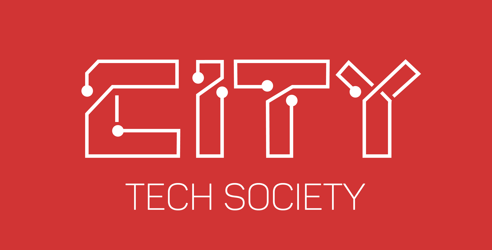

# Web Development 101
*This repository contains all material for the Web Development Course at City University London, provided by City Tech Society     and given by Esraa Dandash starting 12/11/2018.*

## Session 1 : ##
* Contents
         

           
Resources

           
How the Internet works: https://codeburst.io/how-the-internet-works-a240448b409e

           
Introduction to HTML: https://www.w3schools.com/html/html_intro.asp

           
Website Design: https://codeburst.io/9-best-website-layout-examples-and-ideas-for-web-design-in-2018-514420fbc18c

         

--------
